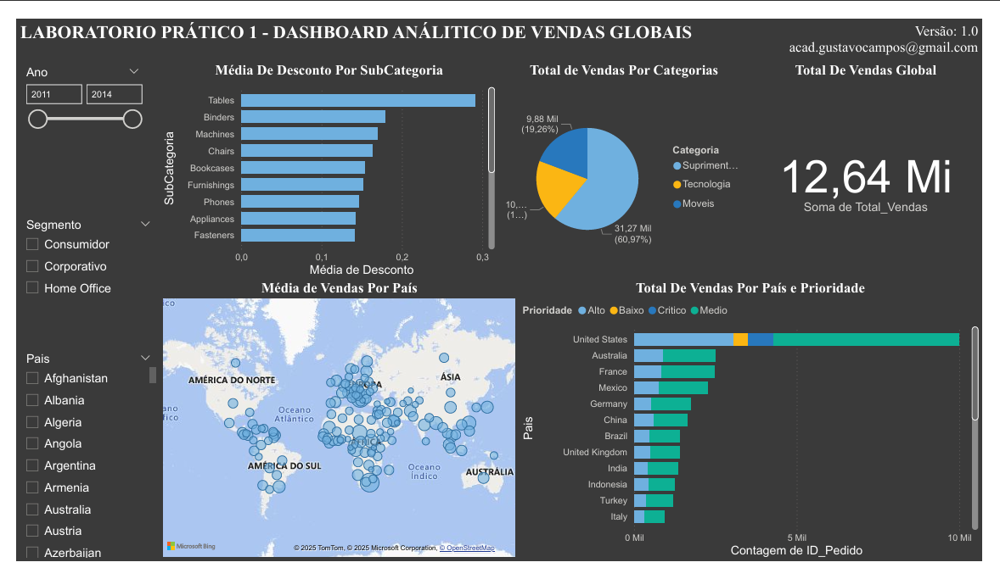

# Lab 1 - Dashboard Analítico de Vendas Globais
- Atividade prática do Capítulo 2.

## DASHBOARD 

## RESPOSTAS 
o Dashboard responde as perguntas abaixo:
- Pergunta 1 -Qual o valor total vendido? 
- Pergunta 2 -Quantas vendas foram realizadas por categoria de produto?
- Pergunta 3 -Quantas vendas foram realizadas por país considerando a prioridade de entrega?
- Pergunta 4 -Qual foi a média de desconto nas vendas por subcategoria de produto?
- Pergunta 5 -Quais países tiveram maior média de valor de venda? 
