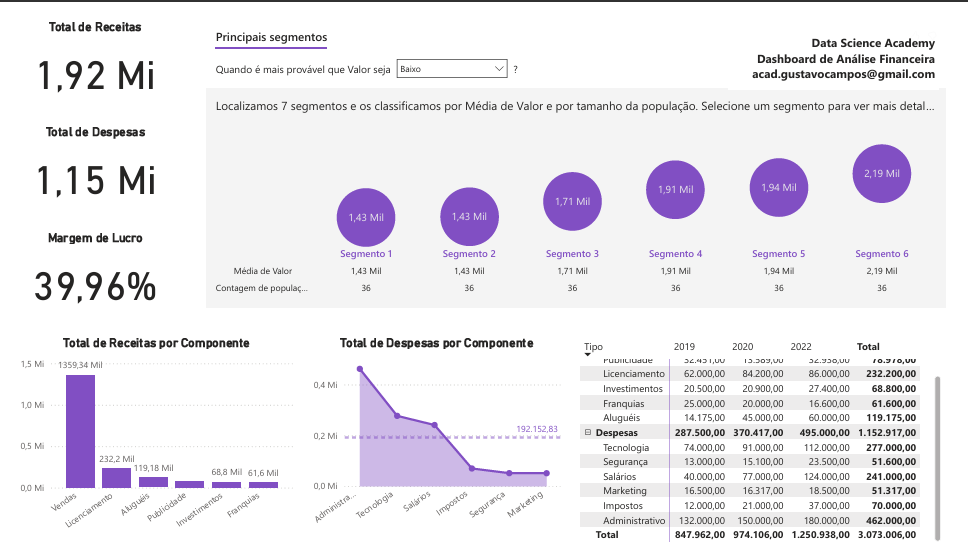

# Mini Projeto 5 - Análise Financeira
- Atividade prática do Capítulo 8.

## DASHBOARD 

## MOSTRA
- Total de Receitas
- Total de Despesas
- Margem de Lucro
- Total de Receitas Por Componente
- Total deDespesas Por Componente em relação à média de Despesas
- Total  de  Receitase  Despesas Por  Componente  e  Por  Ano,com  a  hierarquia Tipo/Componente.
- Além disso mostra os segmentos onde Receitas e Despesas são maiores e menores.
