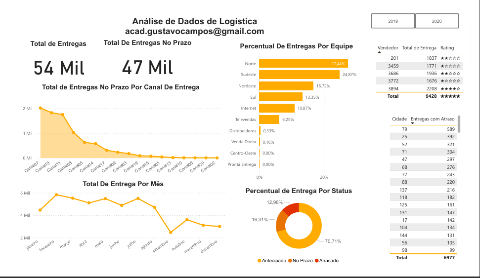

# Mini Projeto 1 - Desconstruindo o dashboard e resolvendo  problemas de análise na área de logística 
- Atividade prática do Capítulo 4.

## DASHBOARD 

## KPIS
O Dashboard precisava mostrar os seguintes KPIs de Logística:
-Total de Entregas no Prazo Por Canal de Entrega
- Percentual de Entregas Antecipadas Por Equipede Entrega
- Total de Entregas Por Mês4-Total de Entregas de Produtos dos Top5 Vendedores
- Total de Entregas com Atraso Por Cidade
- Percentual de Entregas Por Status de Entrega
